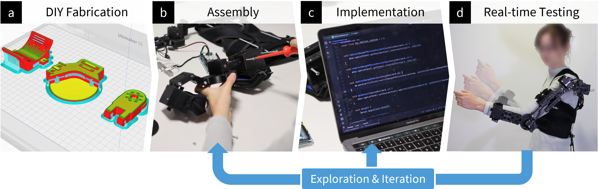
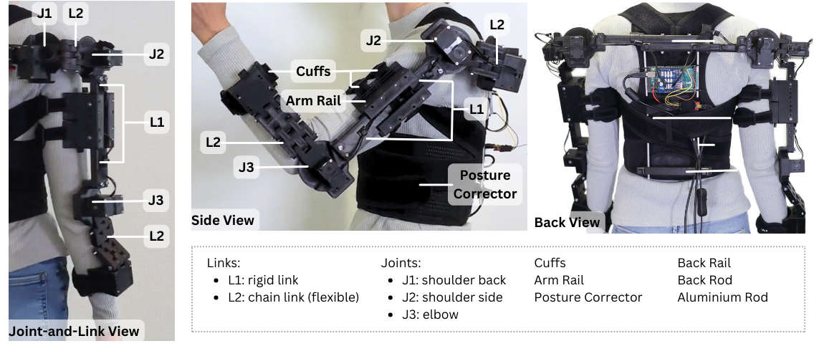
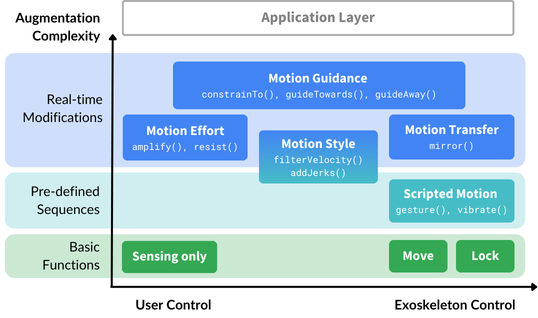
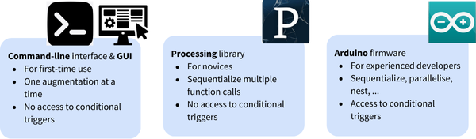

# ExoKit: 
## A Toolkit for Rapid Prototyping of Interactions for Arm-based Exoskeletons 
### (ACM CHI 2025, Released Code)

**[Marie Muehlhaus](https://hci.cs.uni-saarland.de/people/marie-muehlhaus/)**, **[Alexander Liggesmeyer](https://cispa.de/de/people/c01alli)**, **[Jürgen Steimle](https://hci.cs.uni-saarland.de/people/juergen-steimle/)**



### Abstract
Exoskeletons open up a unique interaction space that seamlessly integrates users' body movements with robotic actuation. Despite its potential, human-exoskeleton interaction remains an underexplored area in HCI, largely due to the lack of accessible prototyping tools that enable designers to easily develop exoskeleton designs and customized interactive behaviors. We present ExoKit, a do-it-yourself toolkit for rapid prototyping of low-fidelity, functional exoskeletons targeted at novice roboticists. ExoKit includes modular hardware components for sensing and actuating shoulder and elbow joints, which are easy to fabricate and (re)configure for customized functionality and wearability. To simplify the programming of interactive behaviors, we propose functional abstractions that encapsulate high-level human-exoskeleton interactions. These can be readily accessed either through ExoKit's command-line or graphical user interface, a Processing library, or microcontroller firmware, each targeted at different experience levels.
Findings from implemented application cases and two usage studies demonstrate the versatility and accessibility of ExoKit for early-stage interaction design. 

[Read full article](https://doi.org/10.1145/3706598.3713815).

---
## Fabrication & Assembly Instructions
ExoKit comprises 3d printable modular components.

The following figure presents an overview of the main exoskeleton components:
<p float="left">
  
</p>

Detailed instructions for fabrication and assembly can be found in user manual chapter 2 and 3.

## Installation Instructions and Software Usage

ExoKit provides access to pre-implemented functionalities. These comprise basic functions and five augmentation strategies. They are conceptually organized in a two-dimensional space:

<p float="left">
  
</p>

These functionalities are accessible through different programming interfaces:
<p float="left">
  
</p>

Please refer to user manual chapter 2 and 4-7 for more details.

---

## Citation
If you find our article, released hardware or software useful, please cite our work:

```bibtex
@inproceedings{exoKit,
author = {Muehlhaus, Marie and Liggesmeyer, Alexander and Steimle, J\"{u}rgen},
title = {ExoKit: A Toolkit for Rapid Prototyping of Interactions for Arm-based Exoskeletons},
year = {2025},
isbn = {979-8-4007-1394-1/25/04},
publisher = {Association for Computing Machinery},
address = {New York, NY, USA},
url = {https://doi.org/10.1145/3706598.3713815},
doi = {10.1145/3706598.3713815},
booktitle = {Proceedings of the 2025 CHI Conference on Human Factors in Computing Systems},
location = {Yokohama, Japan},
series = {CHI '25}
}
```

---

## Contact

Please contact [Marie Muehlhaus](https://hci.cs.uni-saarland.de/people/marie-muehlhaus/) if you have any questions about ExoKit for your use.

